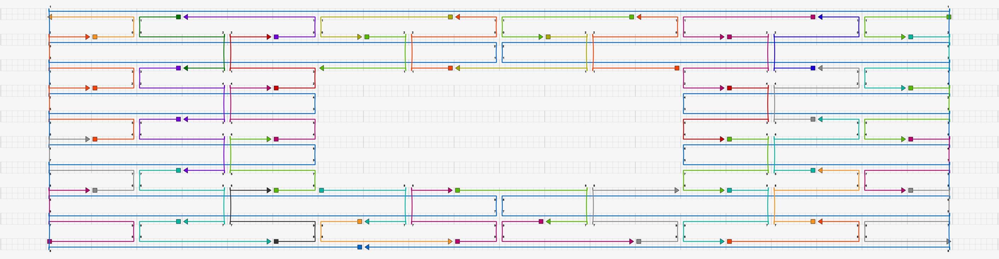
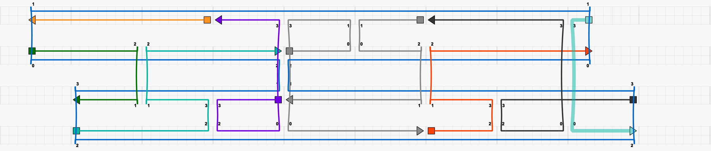

# caDNAno Examples

DNAfold requires caDNAno files (in the json format) to define the structure of the DNA origami to be simulated. For more information on caDNAno, how to install it, and tutorials on how to use it, please see [this webpage](https://cadnano.org/index.html). For additional guidance, there are excellent tutorial videos available online that outline the most critical requirements for designing DNA origami structures with caDNAno. 

In order to simulate DNA origami using DNAfold, the caDNAno design must fulfill two requirements: 

- The scaffold strand must contain a break at some point in the strand. This applies to both linear and circular scaffolds. Whether the scaffold is actually circular can be specified in the "input.txt" file, as explained in {doc}`Parameter Descriptions`.
- Each crossover and strand break must be separated by a multiple of 8 bp. This is becuase DNAfold coarsens the DNA into beads, each of which represent exactly 8 bp, no more, no less. Thus, if a caDNAno design contains a crossover or strand break at a non-integer multiple of 8 bp away from another crossover or strand break, DNAfold will attempt to place a bead over the crossover or strand break, causing the code to throw an error.

To make adhering to the multiple of 8 rule simple when designing a caDNAno structure, first choose the square grid. Notice that becuase square DNA origamis naturally have crossover opportunities every 8 bp, the grid in caDNAno has bold vertical bars every 8 bp. When drawing your scaffold and staple strands on the grid, simply ensure all crossovers and strand breaks fall across one of these bold bars.

## Example: Incorrect 2D Structure

This caDNAno structure has several issues that would throw errors in DNAfold.

- As highlighed in the blue circle, a staple strand ends on a non-integer multiple of 8 bp.
- As highlighed by the black circle, a crossover exists on a non-integer multiple of 8 bp.
- As highlighed by the red oval, two breaks in the staple strands exist on a non-integer multiple of 8 bp.
- There is no break in the scaffold.

## Example: Correct 2D Structure

This caDNAno structure addresses all of the issues with the first example. Thus, DNAfold would successfully simulate this design.

## Example: Incorrect 3D structure

This caDNAno structure raises two red flags:

- The offset of the scaffold in the top two helices does not conform to the multiple of 8 rule, and therefore both the scaffold and several staple strands would cause DNAfold to fail.
- There is no break in the scaffold.

Furthermore, this design exemplifies several design flaws that should be generally avoided when creating DNA origami:

- The light blue staple strand on the far right is less than 16 bp, which is too short.
- The same light blue staple strand contains a binding domain with less than 8 bp, which is too few.
- At the scaffold crossover between the two center helices, a break in the staple strands lines up with the scaffold crossover. Thus, there is a complete break in both the helices at this point.

## Example: Correct 3D structure

This caDNAno remediates the issues with the above design. Thus, it is compatible with DNAfold.

## Example: Smile

This is another example of a more complex structure that could be simulated in DNAfold because it follows the rules described above.

